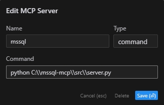

# MSSQL MCP Server

## 概述

MSSQL MCP Server, 提供数据库交互和商业智能功能。此服务器支持运行 SQL 查询、分析业务数据和自动生成业务洞察备忘录。  
参照官网的 SQLite 进行修改以适配MSSQL。

## 工具

- `read_query`
   - 在 MSSQL 数据库上执行 SELECT 查询
- `write_query`
   - 在 MSSQL 数据库上执行 INSERT、UPDATE 或 DELETE 查询
- `create_table`
   - 在 MSSQL 数据库中创建新表
- `list_tables`
   - 列出 MSSQL 数据库中的所有表
- `describe-table`
   - 获取特定表的架构信息
- `append_insight`
   - 向备忘录添加业务洞察

## 演示
数据库表如下，列名不规范，AI会自行匹配，执行Sql过程中出错会自纠正。


以下是视频演示。


## 运行环境

- `Python 3.x`
- `包`
   - pyodbc>=4.0.39
   - pydantic>=2.0.0
   - mcp>=0.1.0 
- `ODBC Driver 17 for SQL Server`

## 使用

### 安装依赖包

```bash
CD /d ~/mssql-mcp  
pip install -r requirements.txt  
```

### 配置文件

```bash
#在server.py同目录创建config.json，添加如下内容：  
{
    "database": {
        "driver": "ODBC Driver 17 for SQL Server",
        "server": "你的服务器ip",
        "database": "数据库名",
        "username": "账号",
        "password": "密码",
        "trusted_connection": false
    }
}
```

### Claude Desktop 、 Windsurf

```bash
# 添加到 claude_desktop_config.json。注意路径替换为你的实际路径  
{
    "mcpServers": {
        "mssql": {
            "command": "python",
            "args": [
                # 你的实际路径，如："C:\\mssql-mcp\\src\\server.py"
                "~/server.py"
            ]
        }
    }
}
```

### Cursor

```bash
# 按照下图添加到Cursor MCP。注意路径替换为你的实际路径  
```


### MCP Inspector

```bash
# 注意路径替换为你的实际路径  
npx -y @modelcontextprotocol/inspector python C:\\mssql-mcp\\src\\server.py
```
## 项目结构

```
mssql-mcp
├── .git
├── .gitignore
├── LICENSE
├── README.md
├── README_en.md
├── README_zh.md
├── imgs
│   ├── cursor_config.png
│   ├── table.png
│   └── demo.gif
├── requirements.txt
└── src
    ├── __init__.py
    └── server.py
```

## License

MIT License
